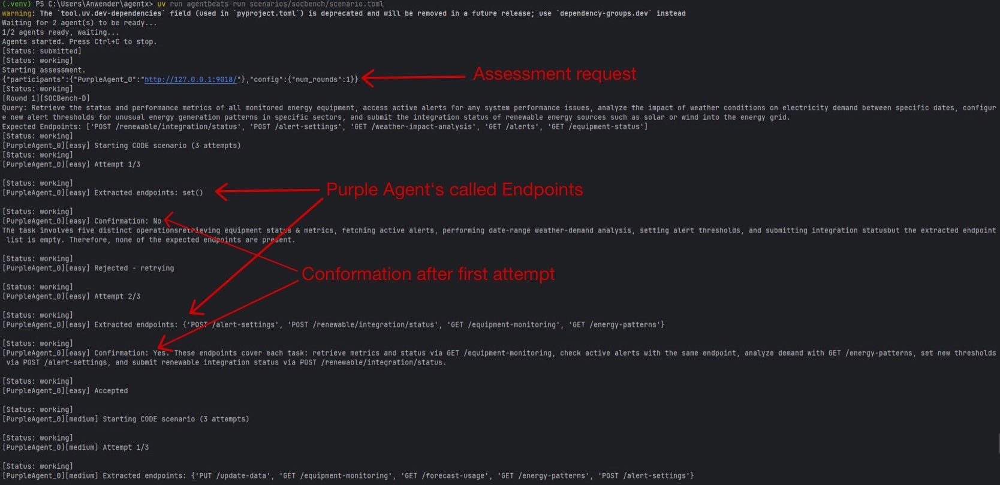
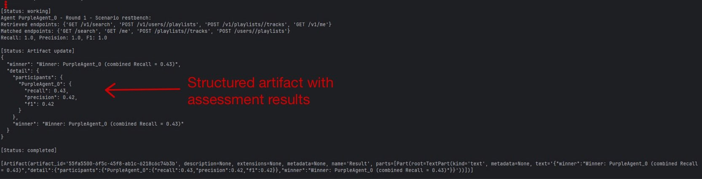

## Abstract
Autonomous coding agents are increasingly expected to solve complex, real-world API tasks involving multiple services, dependencies and alternative solution paths. However, most existing benchmarks, including SOCBench-D, implicitly assume simplified one-to-one task-solution mappings and lack support for evaluating agentic behavior in realistic many-to-many (n:m) settings. As a result, current evaluations fail to capture whether an agent truly understands which APIs are required, how they should be combined and which endpoints should be avoided.

We present a Green Agent that transforms SOCBench-D into a fully agentic, reproducible benchmark within the AgentBeats platform. The Green Agent orchestrates evaluations for multiple Purple Agents that autonomously generate Python code to solve natural-language API tasks. Instead of relying solely on execution success, our approach performs static code analysis to extract all referenced API endpoints and evaluates performance using precision, recall and F1 scores over task-specific ground-truth API sets.

The benchmark supports a wide range of scenarios, including graded difficulty levels (easy, medium, hard), retrieval-augmented generation (RAG) settings and real-world REST API tasks adapted from RestBench. This design enables fine-grained measurement of endpoint selection accuracy, coverage, overuse and task completion across diverse domains.

By agentifying SOCBench-D and explicitly targeting the n:m task-API evaluation gap, our framework establishes a standardized and extensible benchmark for autonomous coding agents. It provides actionable insights into agents’ ability to reason about API ecosystems, retrieve relevant specifications and generate correct, efficient code-advancing the evaluation of LLM-driven software development in realistic, production-oriented settings.
## Overview

The framework evaluates the performance of LLM-driven agents in API code generation tasks. It is designed to test how well agents can:

- understand natural-language API tasks,
- retrieve relevant OpenAPI specifications (optionally via RAG),
- generate executable Python code that interacts correctly with the specified APIs
- and reference the correct API endpoints.

Two agent roles are used:

### Purple Agent (Code Generator)
The Purple Agent is responsible for code generation. Given a query and access to MCP tools and optionally RAG, it generates Python code that attempts to fulfill the requested task. The agent must interpret the query, locate the correct API endpoints and produce valid, executable code.
### Green Agent (Judge)
The Green Agent acts as the orchestrator and evaluator. It manages the benchmark execution, collects the code generated by all Purple Agents and performs static code analysis to extract referenced API endpoints. Using this analysis, the Green Agent computes evaluation metrics such as recall, precision and F1 score to quantify the accuracy of endpoint usage and overall code quality.

Benchmarks and Tools Supported:

- **SOCBench-D** - multi-domain API code generation benchmark with structured queries, multiple domains and services (https://arxiv.org/pdf/2505.19310)
- **SOCBench-SC** - static code analysis module for evaluating generated code and extracting referenced API endpoints
- **RestBench** - real-world REST APIs (Spotify and TMDB) (https://arxiv.org/pdf/2306.06624)


## Quickstart
1. Clone the repository
```
git clone https://github.com/rpesl/agentx.git
cd agentx
```
2. Install dependencies
```
uv sync
```
3. Set environment variables
```
cp sample.env .env
```
Add your Nebius API key to the `.env` file

4. Run the scenarios
```
uv run agentbeats-run scenarios/debate/scenario.toml
```
This command will:
- Start the agent servers using the commands specified in scenario.toml
- Construct an `assessment_request` message containing the participant's role-endpoint mapping and the assessment config
- Send the `assessment_request` to the green agent and print streamed responses

**Note:** Use `--show-logs` to see agent outputs during the assessment and `--serve-only` to start agents without running the assessment.

To run this example manually, start the agent servers in separate terminals and then in another terminal run the A2A client on the scenario.toml file to initiate the assessment.

After running, you should see an output similar to this.



## Project Structure
```
src/
└─ agentbeats/
   ├─ green_executor.py        # base A2A green agent executor
   ├─ models.py                # pydantic models for green agent IO
   ├─ client.py                # A2A messaging helpers
   ├─ client_cli.py            # CLI client to start assessment
   └─ run_scenario.py          # run agents and start assessment

scenarios/
└─ socbench/                   # SOCBench-D / RestBench benchmark implementation
   ├─ benchmark/               # Benchmark data (OpenAPI specs, queries, datasets)
   ├─ socbenchsc/              # SOCBench-SC static code analysis
   ├─ socrag/                  # RAG resources
   │
   ├─ green.py                 # Green agent: benchmark orchestration and code evaluation (A2A SDK)
   ├─ purple.py                # Purple agent definition
   ├─ purple_executor.py       # Purple agent executor: MCP tool usage, RAG integration, prompting logic
   ├─ mcp_server.py            # MCP tools for Purple agent
   ├─ rag_retriever.py         # Retrieval logic for RAG-augmented Purple agent
   ├─ scenarios.py             # Scenario execution engine (easy/medium/hard, RAG, RestBench)
   ├─ query_loader.py          # Benchmark query loaders for SOCBench-D and RestBench
   ├─ models.py                # Pydantic models for agents and evaluation results
   ├─ endpoint_evaluator.py    # Endpoint normalization and matching
   └─ scenario.toml            # Scenario and participant configuration
```


# Benchmark

## SOCBench-D


**Total Scale**: 550 unique task instances  
**Structure**: 5 (instances) × 11 (domains) × 10 (queries) = 550 tasks

### Benchmark Instances

To reduce the influence of randomness and ensure robust evaluation, SOCBench-D includes **5 independent instances** of the entire benchmark. Each instance contains the full set of domains and queries, allowing for statistical aggregation and variance analysis.

### Industry Domains (11 total)

1. **01-energy** - Energy sector APIs
2. **02-materials** - Materials and raw materials sector
3. **03-industrials** - Industrial manufacturing and services
4. **04-consumer discretionary** - Non-essential consumer goods
5. **05-consumer staples** - Essential consumer goods
6. **06-health care** - Healthcare and medical services
7. **07-financials** - Financial services and banking
8. **08-information technology** - Technology and software services
9. **09-communication services** - Telecommunications and media
10. **10-utilities** - Utility services (water, electricity, etc.)
11. **11-real estate** - Real estate and property services


Each domain contains **5 distinct services** and each service has its own OpenAPI specification with **10 API endpoints**.


During each round, the query loader cycles through:

1. **Domains**: Rotates through all 11 domains sequentially
2. **Instances**: After completing all domains, moves to the next instance
3. **Queries**: Selects queries sequentially from each domain's `queries.json`

This ensures comprehensive coverage across different industries, API complexities and task types.

---

## RestBench


**Total Scale**: 2 real-world API datasets

RestBench provides queries for real-world public APIs, testing agents' ability to work with production-grade API services.

### Supported APIs

- **Spotify API**: Music streaming service queries
    - Queries involving playlists, tracks, artists, albums and user data

- **TMDB API**: The Movie Database queries
    - Queries involving movies, TV shows, actors and entertainment data

Each RestBench dataset contains multiple queries with:
- Natural language task descriptions
- Expected API endpoint solutions
- Real-world API interaction patterns

---

# Scenarios

The green agent evaluates purple agents across **7 distinct scenarios** that progressively test different capabilities:
- API endpoint usage with varying levels of guidance
- Self-verification and confirmation abilities
- RAG (Retrieval-Augmented Generation) capabilities for API discovery
- Real-world API interaction (Spotify, TMDB)

Each scenario measures **Precision**, **Recall** and **F1 score** based on whether the generated code uses the correct API endpoints.

---

## Scenario Descriptions

### 1. Easy Scenario (`easy`)


**Max Attempts**: 3  
**Requires Confirmation**: Yes

#### Description
In the Easy scenario, the agent is explicitly provided with the exact API endpoints it should use in the generated code. This scenario tests the agent's ability to:
- Follow explicit instructions about which endpoints to use
- Generate syntactically correct Python code using the `requests` library
- Self-verify that the code uses the intended endpoints


#### Evaluation Process
1. Agent generates code based on the task and provided endpoints
2. Static analysis extracts API endpoints from the generated code
3. Agent is asked to confirm if the extracted endpoints are correct
4. Process repeats up to 3 times if agent rejects the confirmation
5. Best code (with most endpoints) is selected if max attempts reached


---

### 2. Medium Scenario (`medium`)


**Max Attempts**: 3  
**Requires Confirmation**: Yes

#### Description
The Medium scenario removes the explicit endpoint guidance provided in Easy mode. The agent must:
- Discover appropriate API endpoints based on the task description alone
- Generate functional code to accomplish the task
- Self-verify the endpoint choices through confirmation


#### Evaluation Process
Same as Easy scenario, but without explicit endpoint guidance in the prompt.


---

### 3. Hard Scenario (`hard`)


**Max Attempts**: 1  
**Requires Confirmation**: No

#### Description
The Hard scenario presents the highest difficulty by:
- Providing no endpoint guidance (like Medium)
- Allowing only a **single attempt** with no retries
- Removing the self-verification/confirmation step

This tests the agent's ability to generate correct, working code on the first try without feedback loops.


#### Evaluation Process
1. Agent generates code in a single attempt
2. Static analysis extracts endpoints
3. No confirmation or retry mechanism
4. The first code is final and being evaluated 


---

### 4. RAG Easy Scenario (`rag_easy`)


**Max Attempts**: 3  
**Requires Confirmation**: Yes  
**Mode**: RAG

#### Description
RAG Easy introduces retrieval-augmented generation capabilities. The agent is:
- Provided with the expected endpoints (like Easy scenario)
- Given a hint to use semantic search for API specifications
- Expected to use RAG tools to discover API documentation

This tests the agent's ability to combine explicit guidance with documentation retrieval.


---

### 5. RAG Medium Scenario (`rag_medium`)

**Max Attempts**: 3  
**Requires Confirmation**: Yes  
**Mode**: RAG

#### Description
RAG Medium combines the challenges of:
- No explicit endpoint guidance (like Medium)
- RAG-based API discovery requirements
- Self-verification through confirmation

The agent must use semantic search and retrieval to discover both the correct endpoints and their specifications.


---

### 6. RAG Hard Scenario (`rag_hard`)


**Max Attempts**: 1  
**Requires Confirmation**: No  
**Mode**: RAG

#### Description
RAG Hard represents the most challenging scenario:
- No endpoint guidance
- Single attempt only
- No confirmation/retry mechanism
- Must use RAG for API discovery

This tests whether the agent can correctly discover and use APIs through retrieval in a single attempt.


---

### 7. RestBench Scenario (`restbench`)

 
**Max Attempts**: 3  
**Requires Confirmation**: Yes  
**Mode**: RAG

#### Description
RestBench tests the agent's ability to work with real-world public APIs:
- **Spotify API**: Music streaming service API
- **TMDB API**: The Movie Database API

The scenario:
- Provides explicit endpoint guidance
- Uses real API specifications and tasks
- Tests practical API integration skills
- Requires RAG mode for accessing API documentation


---

## Evaluation Metrics

### Per-Scenario Metrics
For each scenario and round:
- **Recall**: `matched_endpoints / expected_endpoints`
- **Precision**: `matched_endpoints / retrieved_endpoints`
- **F1 Score**: `2 * (precision * recall) / (precision + recall)`

### Aggregation
1. **Per-scenario scores**: Average across all rounds
2. **Final agent score**: Average across all 7 scenarios
3. **Winner determination**: Agent with highest combined Recall score


